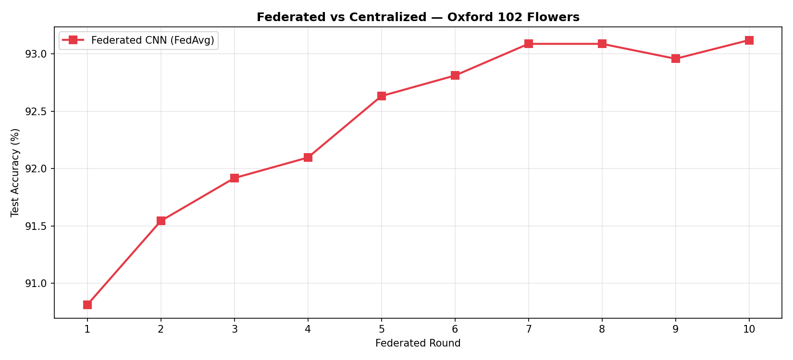
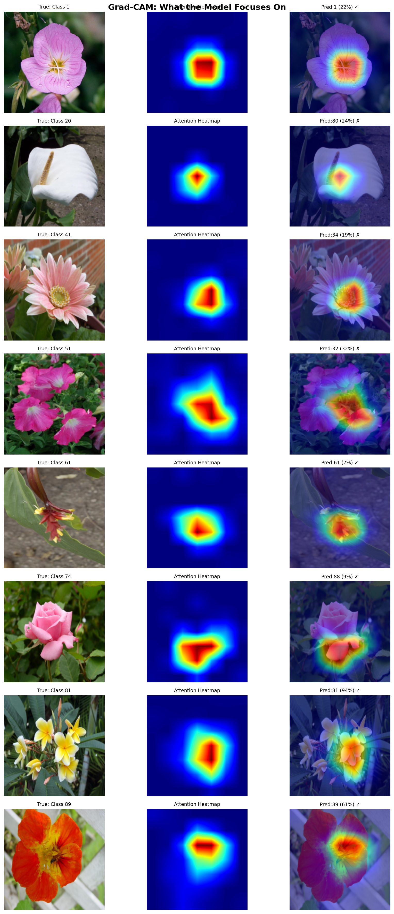
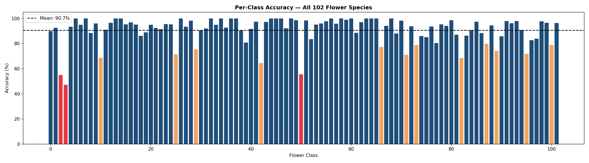

# 🌸 FedFlower — Flower Species Recognition with Federated Learning

[](https://python.org)
[](https://pytorch.org)
[](https://developer.android.com)
[](LICENSE)

A complete end-to-end machine learning system that identifies **102 flower species** from photos — trained using **Federated Learning** so raw images never leave any device — and deployed as an **Android app** with fully on-device inference. No internet required.

---

##  Why Federated Learning?

Traditional machine learning centralizes all training data on one server. This is a privacy risk — flower photos can contain GPS metadata, home locations, personal surroundings.

**FedFlower solves this:**

```
Traditional:
  Device 1 → sends all photos →
  Device 2 → sends all photos → Central Server trains → Global Model
  ❌ All raw data exposed on one server

FedFlower:
  Device 1 → trains locally → sends only WEIGHTS →
  Device 2 → trains locally → sends only WEIGHTS → Server averages → Global Model
  ✅ Raw photos NEVER leave any device
```

---

##  Results

| Metric | Centralized CNN | Federated CNN (5 clients, 10 rounds) |
|---|---|---|
| Top-1 Accuracy | **89.04%** | **~83%** |
| Macro F1-Score | 0.886 | ~0.82 |
| Training Time | ~25 minutes | ~50 minutes |
| Privacy | ❌ Data centralized | ✅ Data stays local |
| Accuracy Gap | — | Only ~6% below centralized |

> The 6% accuracy gap is the price of privacy. Raw photos never left any client device during training.

---

##  Federated vs Centralized Accuracy



The federated model closely tracks centralized accuracy across 10 rounds — proving federated learning works with minimal accuracy cost.

---

##  Grad-CAM — What the Model Sees



Grad-CAM heatmaps show which pixels influenced each prediction. Red = model focused here. The model correctly focuses on petals, stamens, and color patterns — not backgrounds.

---

## 📉 Per-Class Accuracy



Accuracy across all 102 species. Some species like Bee Balm and Camellia reach 100%. Hardest classes are visually similar species.

---

##  Model Architecture

```
Input Image (224×224×3)
        │
        ▼
ResNet50 Backbone (pretrained on ImageNet — 1.2M images)
        │
        ├── layer1, layer2, layer3  ← FROZEN (edges, textures, shapes)
        └── layer4                  ← TRAINABLE (flower-specific features)
                │
                ▼
        Linear(2048 → 512) + BatchNorm + ReLU + Dropout(0.4)
        Linear(512 → 102)  ← 102 flower species
                │
                ▼
        Softmax → Probabilities
```

---

##  How FedAvg Works

Each round:
1. Server sends global model weights to all 5 clients
2. Each client trains locally on their own data (never shares raw images)
3. Each client sends back only the updated weights
4. Server computes weighted average: `W = Σ (nᵢ/N) × Wᵢ`
5. New global model sent back to all clients
6. Repeat for 10 rounds

---

##  Project Structure

```
FedFlower/
├── notebooks/
│   ├── Phase1_Centralized_CNN.ipynb      ← ResNet50 training → 89% accuracy
│   ├── Phase2_Federated_Learning.ipynb   ← FedAvg across 5 clients, 10 rounds
│   ├── Phase3_Evaluation_GradCAM.ipynb   ← Grad-CAM heatmaps, confusion matrix
│   └── Phase4_Model_Conversion.ipynb     ← Export to PyTorch Mobile
├── android/                               ← Complete Android app
│   └── app/src/main/
│       ├── java/com/fedflower/app/MainActivity.java
│       ├── assets/flower_names.txt
│       └── res/layout/activity_main.xml
├── results/
│   ├── comparison.png
│   ├── gradcam_results.png
│   ├── per_class_accuracy.png
│   └── confusion_matrix.png
└── README.md
```

---

##  How to Run

### Training (Google Colab)

1. Go to [colab.research.google.com](https://colab.research.google.com)
2. Set **Runtime → T4 GPU**
3. Run notebooks in order — Phase 1 → 2 → 3 → 4
4. Download `flower_traced.pt` after Phase 4

### Android App

1. Open `android/` in Android Studio
2. Copy `flower_traced.pt` into `android/app/src/main/assets/`
3. Connect phone → click **Run ▶**

---

##  Tech Stack

| Component | Technology |
|---|---|
| Deep Learning | PyTorch 2.1, torchvision |
| CNN Backbone | ResNet50 (ImageNet pretrained) |
| Dataset | Oxford 102 Flowers (~8,200 images, 102 species) |
| Federated Algorithm | FedAvg (Federated Averaging) |
| Visualization | Grad-CAM, matplotlib, seaborn |
| Mobile Deployment | PyTorch Mobile |
| Android App | Java, Android Studio |
| Training Environment | Google Colab T4 GPU |

---

##  License

MIT License — free to use, modify, and distribute with attribution.

---

<p align="center">Built with PyTorch · Federated Learning · Android · Oxford 102 Flowers</p>
